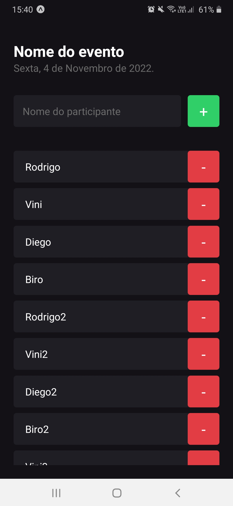

<h1 align="center"> Project React Native - Rocketseat Ignite </h1>

# Demo
<!--  -->


---

#Índice
- [Demo](#demo)
- [About the project](#about-the-project)
- [Step to step for create the project in Expo](#step-to-step-for-create-the-project-in-expo)
  - [FlatList](#flatlist)
  - [ScrollView](#scrollview)
  - [Alert.alert](#alertalert)
- [🚀 Technologies used in this project](#-technologies-used-in-this-project)
- [📥 How to use](#-how-to-use)
- [🚀 Developer](#-developer)
- [📞 Contact me](#-contact-me)

---

# About the project
Este é um projeto desenvolvido no Rocketseat Ignite - React Native - trilha atualizada

Este projeto que parece ser bem simples, mas ele é rico em conceitos muito utilizado no dia a dia de um dev React, listo abaixo alguns dos conceitos aprendidos / revisados neste primeiro projeto.

- [x] O que é React Native? Quem Usa? O que é Expo?
- [x] Fundamentos: Criar o projeto - Estrutura de pastas e arquivos e a executar o projeto
- [x] Fundamentos: Funcionamento do React Native - Refresh e Reload - JSX
- [x] Fundamentos: Estilizando elementos com StyleSheet - Densidade de Pixel(não utilizamos px)
- [x] Fundamentos: Estilizando elementos com StyleSheet - StyleSheet
- [x] Fundamentos: Estilizando elementos com StyleSheet - Flex Box - Flex Direction
- [x] Fundamentos: Export e Export Default
- [x] Fundamentos: Componentes - TextInput
- [x] Fundamentos: Componentes - TouchableOpacity
- [x] Fundamentos: Componentes - Criando um Componente
- [x] Fundamentos: Componentes - Propriedades
- [x] Fundamentos: Componentes - StatusBar
- [x] Fundamentos: Componentes - Listas - ScollView(poucos elementos) e FlatList(mais Performática, lista maiores)
- [x] Fundamentos: Alerts
- [x] Fundamentos: Hooks - Conceito de Hooks
- [x] Fundamentos: Hooks - useState
- [x] Fundamentos: Hooks - Imutabilidade
- [x] Fundamentos: Hooks - State e TextInput
- [x] Fundamentos: Hooks - Render
- [x] Fundamentos: Hooks - Manipulação de estados
- [x] Fundamentos: Hooks - Estado Assíncrono

Este projeto foi desenvolvido utilizando Expo, neste projeto foi utilizado o componente de Text para inserir as informações de titulo da aplicação, bem como o componente de TextInput, para obter as informações do usuario, e o TouchablOpacity para criar o botão.
Logo abaixo na nossa interface, tem a nossa FlatList para listar as informações, e quando não tem informações preenchidas no array de dados da nossa FlatList, o app exibe a informação de "Ningém chegou no evento ainda? Adicione participantes a sua lista de presença."
Trabalhamos com stylesheet, aprendemos que o Flex já vem habilitado por padrão no React Native, trabalhamos também com Flex direction.
Trabalhamos utilizando o Alert do React native, tanto para exibir uma simples mensagem, quanto alert com condicionais de sim e não.
Trabalhamos com statusBar tambem, além de hooks do react, e muito mais...

<h3>Translate English</h3>

This is a project developed at the Rocketseat Ignite  - React Native - updated trail

This project that seems to be very simple, but it is rich in concepts very used in the day to day of a React dev, I list below some of the concepts learned / revised in this first project.

- [x] What is React Native? Who use? What is Expo?
- [x] Fundamentals: Creating the project - Folder and file structure and running the project
- [x] Fundamentals: How React Native Works - Refresh and Reload - JSX
- [x] Fundamentals: Styling elements with StyleSheet - Pixel Density (we don't use px)
- [x] Fundamentals: Styling elements with StyleSheet - StyleSheet
- [x] Fundamentals: Styling elements with StyleSheet - Flex Box - Flex Direction
- [x] Fundamentals: Export and Export Default
- [x] Fundamentals: Components - TextInput
- [x] Fundamentals: Components - TouchableOpacity
- [x] Fundamentals: Components - Creating a Component
- [x] Fundamentals: Components - Properties
- [x] Fundamentals: Components - StatusBar
- [x] Fundamentals: Components - Lists - ScollView(few elements) and FlatList(more Performatic, larger lists)
- [x] Fundamentals: Alerts
- [x] Fundamentals: Hooks - Concept of Hooks
- [x] Fundamentals: Hooks - useState
- [x] Fundamentals: Hooks - Immutability
- [x] Fundamentals: Hooks - State and TextInput
- [x] Fundamentals: Hooks - Render
- [x] Fundamentals: Hooks - State manipulation
- [x] Fundamentals: Hooks - Asynchronous State

This project was developed using Expo, in this project the Text component was used to insert the application's title information, as well as the TextInput component, to obtain the user's information, and TouchablOpacity to create the button.
Just below our interface, there is our FlatList to list the information, and when there is no information filled in the data array of our FlatList, the app displays the information of "Nobody arrived at the event yet? Add participants to your attendance list. "
We work with stylesheet, we learned that Flex is already enabled by default in React Native, we also work with Flex direction.
We work using the Alert from React native, both to display a simple message and alert with yes and no conditionals.
We work with statusBar too, in addition to react hooks, and much more...

---

# Step to step for create the project in Expo 

Create a folder for your project named nlw/server.
```js
npx expo init [projectName] 
cd [projectName]
```

## FlatList
```js
const participants = ['Rodrigo', 'Vini', 'Diego', 'Biro','Rodrigo2', 'Vini2', 'Diego2', 'Biro2','Vini3', 'Diego3', 'Biro3',]

<FlatList
    data={participants}
    keyExtractor={item => item}
    renderItem={({ item }) => (
        <Participant 
        key={item} 
        name={item} 
        onRemove={() => handleParticipantRemove(item)} 
        />
        )}
    showsHorizontalScrollIndicator={false}
    ListEmptyComponent={() => (
        <Text style={styles.listEmptyText}> Ningém chegou no evento ainda? Adicione participantes a sua lista de presença. </Text>
    )}
/>
```

## ScrollView
```js
const participants = ['Rodrigo', 'Vini', 'Diego', 'Biro','Rodrigo2', 'Vini2', 'Diego2', 'Biro2','Vini3', 'Diego3', 'Biro3',]

<ScrollView showsVerticalScrollIndicator={false} >
    {
        participants.map((participant) => (
            <Participant 
                key={participant} 
                name={participant} 
                onRemove={() => handleParticipantAdd('Tayse Rosa 2')} 
            />
        ))
    }
</ScrollView>
```

## Alert.alert
```js
Alert.alert("Remover", `Remover o participante ${name} ?`, [
            {
                text: 'Sim', 
                onPress: () => Alert.alert('Deletado!', `o participante ${name}`),
                style: 'default'
            },
            {
                text: 'Não', 
                style: 'cancel'
            }
        ]);
    }
```

useState:
```js
const [ participants, setParticipants ] = useState(['João']);

setParticipants(prevState => [ ...prevState, 'Ana'])
```

TextInput (ver no console cada letra sendo alterada):
```js
<TextInput 
    style={styles.input}
    placeholder='Nome do participante'
    placeholderTextColor="#6b6b6b"
    onChangeText={text => setParticipantName(text) }
/>
```

---

# 🚀 Technologies used in this project
The project was developed using the following technologies:

- [x] React Native CLI
- [x] React Native EXPO
- [x] Typescript
- [x] Componentização
- [x] Props (propriedades)
- [x] Passar funções por parâmetros para o component
- [x] ScrollView
- [x] FlatList (mais performática)
- [x] Hooks (useState, useEffect etc...)
- [x] Imutabilidade
- [x] map
- [x] includes, push, filter(para usar em listas arrays) etc..
- [x] Alert.alert
- [x] console.log()
- [x] console.warm()
- [x] console.error()
- [x] 

# 📥 How to use
```js

    //Clone the repository
    $ git clone https://github.com/TayseRosa/rocketseat-ignite-reactnative-trilha-atualizada.git
    
    //Enter directory
    $ cd rocketseat-ignite-reactnative-trilha-atualizada

    //Install dependencies
    $ npm install 

    //Start the project
    $ expo start
    

``` 

# 🚀 Developer

<a href="https://www.tayserosa.dev">
 
 <br />
 <sub><b>Tayse Rosa</b></sub></a> <a href="https://www.tayserosa.dev" title="Tayse Rosa">🚀</a>


<hr />

# 📞 Contact me

👋🏽 Entre em contato!


<a href="https://www.linkedin.com/in/tayse-rosa-3b683151/" target="_blank">

</a>
<br/>
<br/>

<a href="https://github.com/TayseRosa/" target="_blank">

</a>
<br/>
<br/>

<a href="https://api.whatsapp.com/send?phone=5551982368077" target="_blank">

</a>
<br/>
<br/>


<a href="https://www.tayserosa.dev" target="_blank">

</a>
<br/>
<br/>

<p style="text-align: center">Developer with ❤️ by Tayse Rosa</p>
